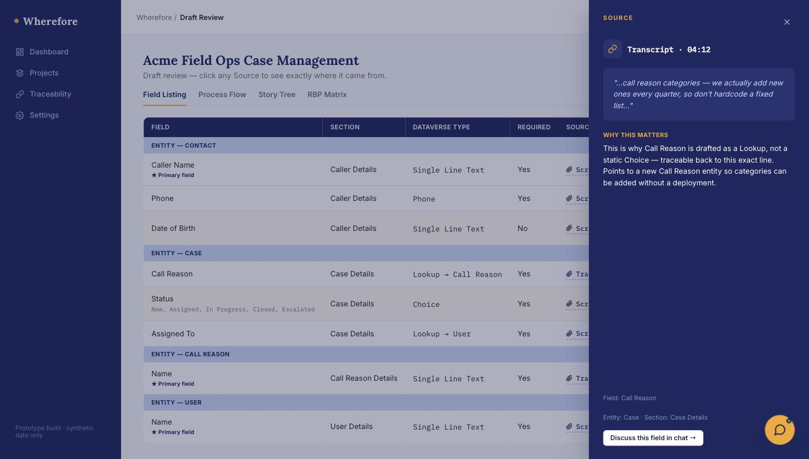
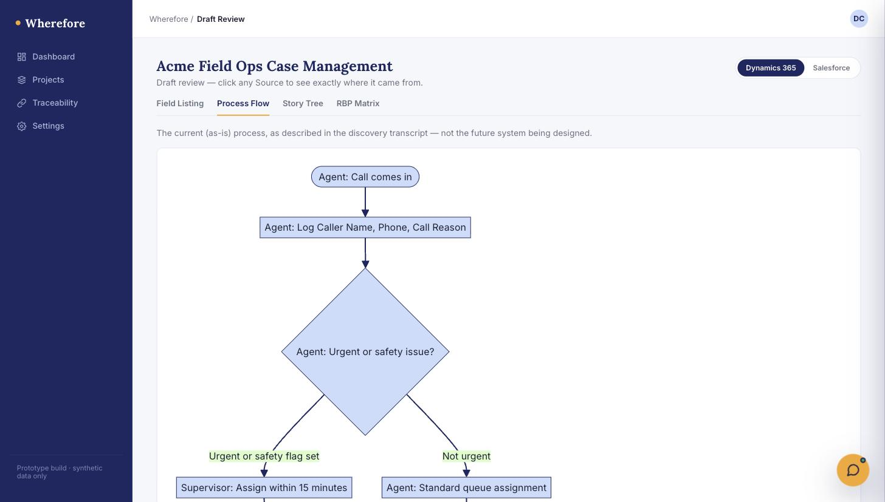
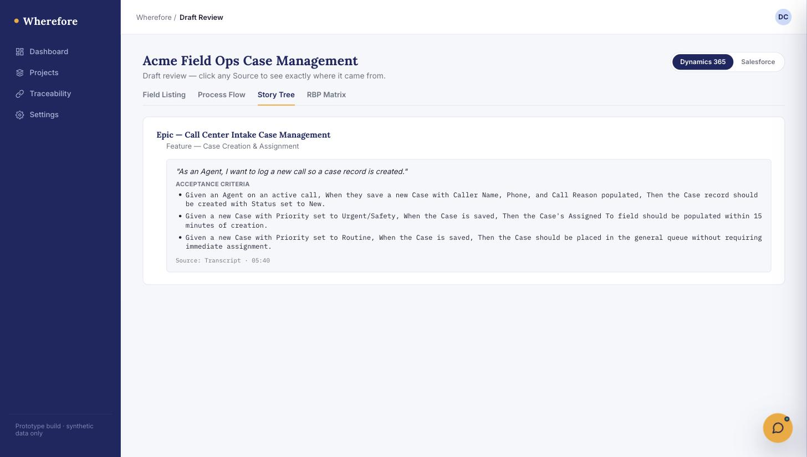

# Wherefore

Wherefore turns raw discovery material — call transcripts, screenshots of an
existing system — into structured delivery artifacts a technology consultant
needs: a **Field Listing**, a **Story Tree** (Epic → Feature → Story →
Acceptance Criteria), an **RBP Matrix** (role-based permissions), and a
**Process Flow** mapping the current (as-is) business process. Every
generated item is traceable back to the exact transcript timestamp or
screenshot region it came from.

It's a **copilot, not an agent**: AI drafts each artifact, a human reviews
and approves before anything is finalized. Nothing happens autonomously.

See [`docs/functional-spec.md`](docs/functional-spec.md) for what it does
and why, and [`docs/technical-spec.md`](docs/technical-spec.md) for
architecture, data model, and build details.

## Screenshots

**Field Listing, with traceability.** Every field cites the exact
transcript line it came from — here, why "Call Reason" is drafted as a
Lookup instead of a static Choice.



**Process Flow.** The current (as-is) process as described in discovery,
not the future system being designed — kept as its own artifact so it
doesn't get conflated with the Story Tree.



**Story Tree.** Epic → Feature → Story → Acceptance Criteria, with
multiple testable Given/When/Then criteria per story — not a single
paraphrase of the underlying rule.



## Status

Private portfolio/demo project, built solo. Single-operator by design —
SQLite, local file storage, no accounts or multi-tenancy. Not a commercial
product or hosted service.

## Stack

FastAPI (Python) · SQLite · a vanilla HTML/CSS/JS frontend served as a
single static page · local filesystem for uploads.

Drafting is powered by Claude, through either of two interchangeable
engines (configured in `config/config.json`):

- **API key** — an Anthropic Console API key, tool-use with a forced schema.
- **Claude Code CLI** — shells out to a local `claude -p` session (requires
  the [Claude Code CLI](https://claude.com/claude-code) installed and
  signed in).

## Setup

```bash
git clone <this-repo-url> wherefore
cd wherefore/backend
python3 -m venv .venv
.venv/bin/pip install -r requirements.txt
cp ../config/config.example.json ../config/config.json
# edit config/config.json: set claude_engine to "api_key" or "claude_code_cli",
# and anthropic_api_key if using "api_key"
```

Then from the repo root:

```bash
./run.sh
```

The app binds to `127.0.0.1:8000` only — no accounts, no login screen, not
meant to be exposed beyond localhost.

`config/config.json` is git-ignored — it holds your API key if you use that
engine, and is never committed.

## License

Source-available, not open source: the [Wherefore Source License 1.0](LICENSE)
(adapted from the Business Source License 1.1 template). Free to use for any
purpose if you're an individual using it personally, or an organization with
fewer than 5 total employees/members. Anyone else needs a commercial license
— [request one here](https://docs.google.com/forms/d/e/1FAIpQLSe_GEycd28k4l_sNgBL1mwlj_L1iZI-aOsq21iLq3wQEQH9mA/viewform).

This automatically converts to the [GNU AGPL v3.0](licenses/AGPL-3.0.txt) —
a real open-source license — on 2030-09-07, per the terms in LICENSE. If a
newer version of Wherefore is released before then, its own LICENSE file
governs it with its own (later) conversion date; this one still converts on
schedule regardless.
